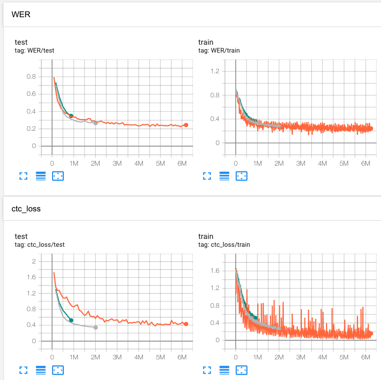

# wav2letter--

Repository for Korean speech-to-text.

## Results

* Note that current version does not include any LM (Language Model).
* Values of WER (Word Error Rate) on the graph is actually a CER (Character Error Rate).
* Took almost a month to train this model.

### Sample

|              | Texts                                                        |
| ------------ | ------------------------------------------------------------ |
| Answer label | 데 뭐 쾌락이라는 게 기분이 좋은 거잖아. 데 기분이 좋다고 해서 모두가 다 나쁜 걸까, 라는 생각을 해. |
| Output       | 근데 뭐 켸라ᅡᆨ이라는 게 기분이 좋은 거잖아ᅡ. 그 ᄀ기분이 좋다ᄀ고 해서 모두가 ᄃ다다ᅡ쁜 거ᅥᆯ까 라는 새ᅢᆼ각을 해. |
| CTC Decoded  | 근데 뭐 켸락이라는 게 기분이 좋은 거잖아. 그 기분이 좋다고 해서 모두가 다다쁜 걸까 라는 생각을 해. |

## Datasets

| Name        | url                                                          |
| ----------- | ------------------------------------------------------------ |
| KSS         | https://www.kaggle.com/bryanpark/korean-single-speaker-speech-dataset |
| Clova Call  | https://github.com/clovaai/ClovaCall                         |
| Zeroth      | https://github.com/goodatlas/zeroth                          |
| KsponSpeech | https://aihub.or.kr/aidata/105/download                      |
| ProSem      | https://github.com/warnikchow/prosem                         |
| Pansori     | https://github.com/yc9701/pansori-tedxkr-corpus              |
| Acryl       | http://aicompanion.or.kr/kor/tech/data.php                   |

## References

1. [wav2letter](https://github.com/facebookresearch/wav2letter)
2. [End-to-end ASR: from Supervised to Semi-Supervised Learning with Modern Architectures](https://arxiv.org/abs/1911.08460)
3. [Listen, Attend and Spell](https://arxiv.org/abs/1508.01211)